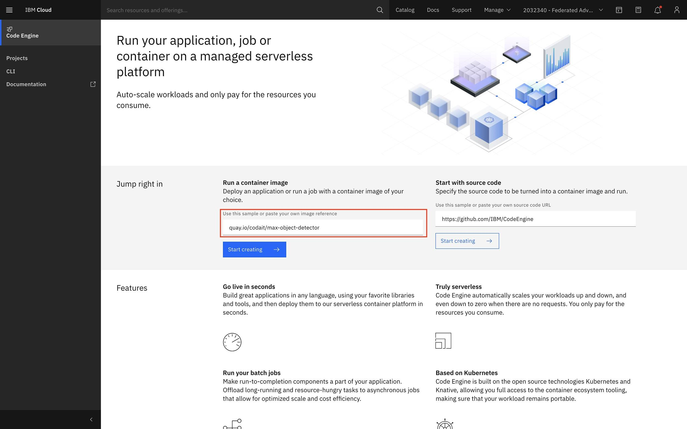
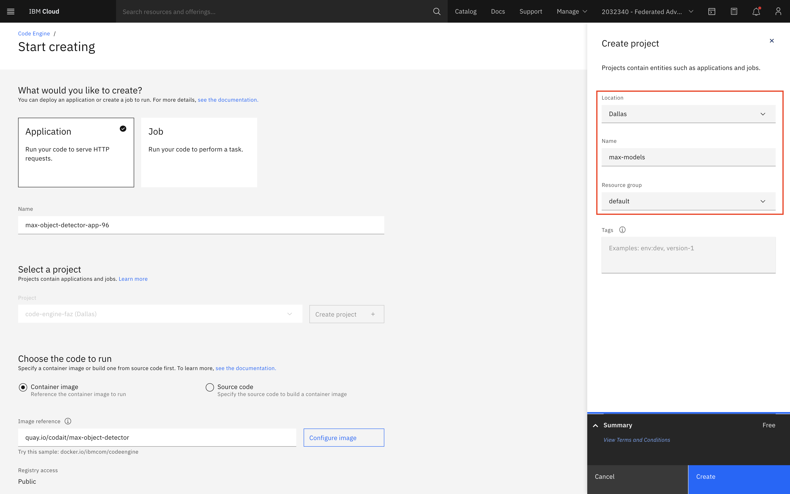
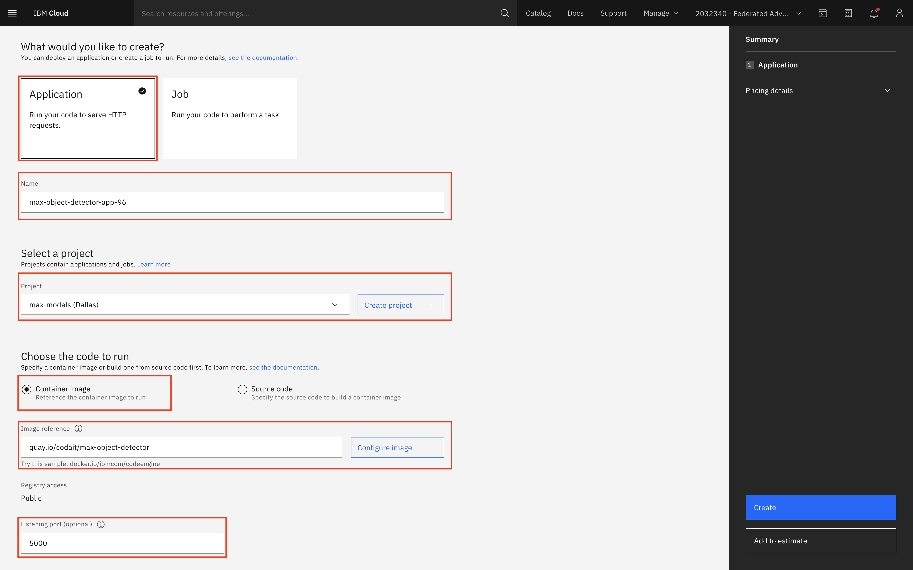
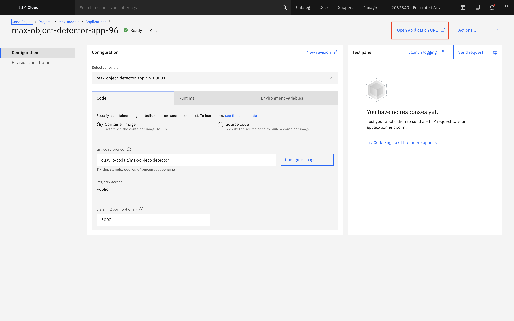
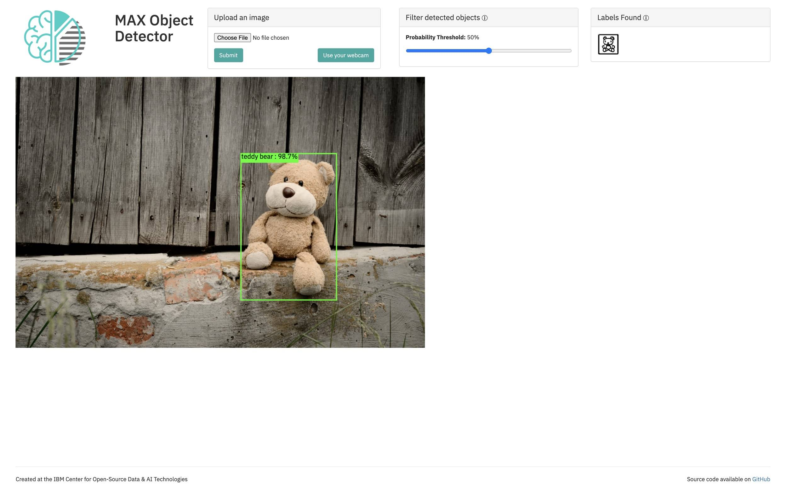

# Deploy your AI models using Serverless Containers

## Workshop Resources 

- Login/Sign Up for IBM Cloud: https://ibm.biz/ddc-emea
  
- Hands-On Guide: https://ibm.biz/CodeEngine-AI

- Slides: https://ibm.biz/CodeEngine-AI-Slides

- Workshop Replay: https://www.crowdcast.io/e/ddc-emea

## Table of Contents
1. [Prerequisites](#Prerequisites)
1. [Learning Objective](#Learning-objective)
1. [Steps](#Steps)  
1. [Deploy with the CLI](#Deploy-with-the-CLI)
1. [Deploy with the UI](#Deploy-with-the-UI)
1. [Verify the application](#Verify-the-application)
1. [Things you can try further](#Things-you-can-try-further)
  
## Prerequisites
  
## **Sign-up/Login to IBM Cloud**

If you are an existing user please [login to IBM Cloud](<PUT TRACK LINK HERE>)

And if you are not, don't worry! We have got you covered! There are 3 steps to create your account on [IBM Cloud](https://ibm.biz/ddc-emea): <br>
1- Put your email and password. <br>
2- You get a verification link with the registered email to verify your account. <br>
3- Fill the personal information fields. <br>
** Please make sure you select the country you are in when asked at any step of the registration process.
  


## Learning objective

This tutorial explains how to use the <a href="https://ibm.biz/ddc-emea" target="_blank" rel="noopener noreferrer">IBM Cloud Code Engine</a> managed serverless platform system to deploy the Model Asset Exchange (MAX). Let's get started!

## Prerequisites

If you are not familiar with the Model Asset Exchange, this [introductory article](https://developer.ibm.com/articles/introduction-to-the-model-asset-exchange-on-ibm-developer/) provides a good overview.

Additionally, you need the following:

* An <a href="https://ibm.biz/ddc-emea" target="_blank" rel="noopener noreferrer">IBM Cloud account</a>.
* The IBM Cloud command-line interface (CLI), which you can access by using <a href="https://ibm.biz/ddc-emea" target="_blank" rel="noopener noreferrer">IBM Cloud Shell</a>.

## Estimated time

With the prerequisites available, it should take you approximately 20 minutes to complete this tutorial.

## Steps

This tutorial shows you how to deploy MAX with Code Engine using two different methods:

* IBM Cloud CLI
* Code Engine GUI

Once you deploy MAX using either of these methods, you verify that you can use the application.

### Deploy with the CLI

First, you need to create a project. Code Engine applications must be tied to a specific project.

1. Open <a href="hhttps://ibm.biz/ddc-emea" target="_blank" rel="noopener noreferrer">IBM Cloud Shell</a>.
1. Before running any Code Engine commands, target a resource group. (This will vary depending on your resource group name; mine is default.)

   ```
   ibmcloud target -g default
   ```

1. Run the following command to create a Code Engine project:

   ```
   ibmcloud ce project create --name sandbox
   ```

1. You should see output similar to the example below:

   ```
   ibmcloud ce project create --name sandbox
   Creating project 'sandbox'...
   ID for project 'sandbox' is 'f8445951-8d47-400c-9833-23e0d60a0811'.
   Waiting for project 'sandbox' to be active...
   Now selecting project 'sandbox'.
   OK
   ```

1. Once you create the project, run the following command to deploy the MAX container as an application. (Note that the `--image` parameter points to an image registry, and the `--port` parameter overrides the <a href="https://cloud.ibm.com/docs/codeengine?topic=codeengine-cli#cli-application" target="_blank" rel="noopener noreferrer">default port (8080)</a>.)

   ```
   ibmcloud ce application create --name max-object-detector --image quay.io/codait/max-object-detector --port 5000
   ```

1. You should see output similar to the example below:

   ```
   Creating application 'max-object-detector'...
   The Route is still working to reflect the latest desired specification.
   Configuration 'max-object-detector' is waiting for a Revision to become ready.
   Ingress has not yet been reconciled.
   Waiting for load balancer to be ready
   Run 'ibmcloud ce application get -n max-object-detector' to check the application status.
   OK
   https://max-object-detector.75asazy1s7n.us-south.codeengine.appdomain.cloud
   ```

### Deploy with the GUI

The steps for deploying with the Code Engine GUI are as short as its CLI equivalent.

Go to the <a href="https://ibm.biz/ddc-emea" target="_blank" rel="noopener noreferrer">Code Engine overview page</a> after logging into IBM Cloud. Enter `quay.io/codait/max-object-detector` into the **Run a container image** text box and click **Start creating**.



On the next screen, create a new project, choose a region that is closest to you, give it a name, and select a resource group.



Once you create the project, you can configure the application. Choose the following options and click **Create**:

* Application or Job: Select **Application**
* Name: Enter a unique name
* Project: Select the newly created project
* Code to run: Select **Container image**
* Image reference: Enter `quay.io/codait/max-object-detector`
* Port: `5000`



### Verify the application

Once the application is deployed, you can view its details from the project view. To launch the application, click the **Open application URL** button on the top right of the screen.



Remember to add `/app` at the end of the opened URL to use the application instead of the API.



With Code Engine running the application, you can now interact with the web app by uploading a photo or using a web camera. Once analyzed, the MAX object detector will highlight common objects in the photo that was submitted.

## Summary

This tutorial illustrates how to deploy a model container from the Model Asset Exchange to the cloud with IBM Cloud Code Engine by following two easy steps: creating a project and deploying the MAX application.

- Login/Sign Up for IBM Cloud: https://ibm.biz/ddc-emea 

- Hands-On Guide: https://ibm.biz/CodeEngine-AI

- Slides: https://ibm.biz/CodeEngine-AI-Slides

- Workshop Replay: https://www.crowdcast.io/e/ddc-emea


## Reference Links

- [Knative Resources](https://www.ibm.com/cloud/knative)
- [When to use IaaS, FaaS, PaaS, and CaaS](https://developer.ibm.com/depmodels/cloud/articles/when-to-use-iaas-faas-paas-and-caas/)
- [IBM Cloud Code Engine](https://cloud.ibm.com/codeengine)
- [IBM Cloud Container Service](https://cloud.ibm.com/container-service)
  
## Done with the workshop? Here are some things you can try further

- IBM Cloud Certifications
   - [IBM Cloud Essentials V2](https://ibm.biz/cloud_essentials)
   - [IBM Cloud Application Development Essentials](https://ibm.biz/cloud_dev_essentials)
   - [IBM Applied Cloud Native Development](https://ibm.biz/cloud_native_dev)

- [Code Engine Sample Apps](https://github.com/IBM/CodeEngine)

## Authors
- [Fawaz Siddiqi](https://linktr.ee/thefaz)
- [EreN Akbaba](https://www.linkedin.com/in/erenakbaba/)
